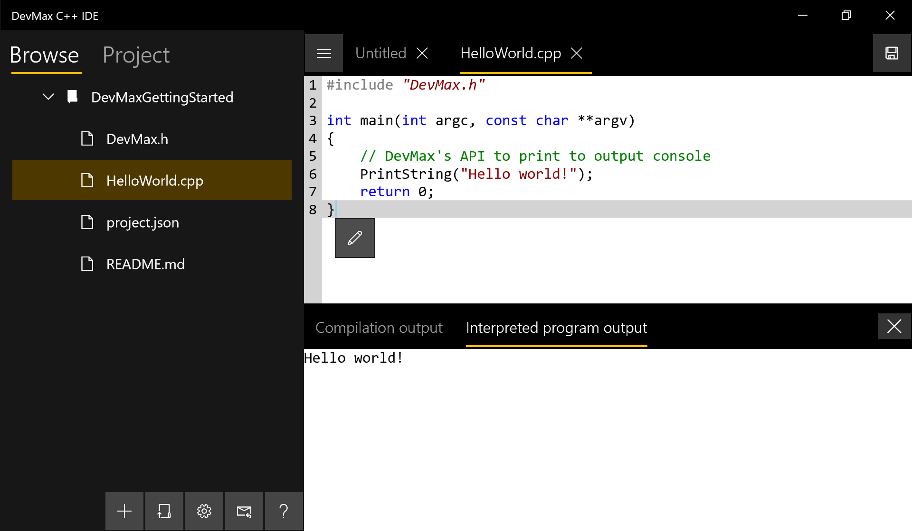

Getting Started with DevMax
===========================

This repository provides an example project configuration to get you started software development with [DevMax IDE](https://www.microsoft.com/en-us/p/devmax/9mzqlt5d5b39) and its sister app C++ Compiler.

If you do not have C++ Compiler installed yet, head over to [our C++ Compiler project](https://github.com/light-tech/UniversalCppCompiler) for installation instructions.

This tutorial will cover

 1. Where to place your projects so that they can be compiled/interpreted.
 2. The structure of a project folder.
 3. The interpreter API and standard C/C++ functions that you can use in your program.

Where to place your project
---------------------------

Due to the limitation of the Universal Windows Platform (UWP), our DevMax and C++ Compiler apps can only accessed _certain designated places_. 

To open the location where DevMax looks for C++ projects, first click on the _Open project_ button (the one between the + and the settings gear button) in main app and then on the _Open project folder in Explorer_ in the pop-up dialog. DevMax should open a folder named `C++Projects` in Windows Explorer. __Note that ONLY projects placed there can be interpreted or compiled.__

The easiest way to get started is to clone this repository

    git clone https://github.com/light-tech/DevMaxGettingStarted

in the opened folder `C++Projects`.

__Tip:__ It is a good idea to make a shortcut to this folder on the desktop so that you can have quick access to your projects.

Project folder structure
------------------------

The key files are:
 * [`project.json`](project.json): DevMax project file with basic features like reusable commands which you can modify to suit your project. This is a human-readable [JSON file](https://en.wikipedia.org/wiki/JSON). This file is necessary.
 * [`DevMax.h`](DevMax.h): Our standard interpreter API to allow communication between an interpreted program and DevMax IDE. (See the next section for its purpose.)
 * The source files, for example [`HelloWorld.cpp`](HelloWorld.cpp), the standard program to illustrate outputing text to DevMax's console. It is up to you to structure your own source code, but the correct location needs to be reflected in the project file.

DevMax Interpreter API
----------------------

A typical compiled C program uses various C's `stdio.h` functions such as `printf` to output information to the console (a.k.a. _Command Prompt_ in Windows or _Terminal_ in Linux). However, it is better that a program which is interpreted by DevMax print out its output to the text box in DevMax (see screenshot above) so that you don't have to switch back-and-forth between different windows during development. To allow that, DevMax provides a single C function

    void PrintString(const char* string);

that a program can use to pass a text string to DevMax's output terminal. This function is the DevMax-equivalent of `fputs(string, stdout)` or `printf("%s", string)`.

The header [`DevMax.h`](DevMax.h) declares this function for you.

Standard C API
--------------

DevMax's interpreted program has access to most of the standard C functions. If you don't want to install the system C/C++ headers, you can just add the functions' signatures (a.k.a. prototypes) you want. With this, you can use DevMax's interpretation feature right away without having to perform extra set-up (namely, copying the system headers to the correct locations).

For instance, simply declare

    extern "C" void *malloc(unsigned int);

and then use `malloc` as if you included `<stdlib.h>`. See the header [`DevMax.h`](DevMax.h) for examples of how to do this declaration properly. To see this in action, interpret [Sort.cpp](Sort.cpp).

At the moment, we do not yet support C++ standard library due to its significant dependency of the internal implementation.